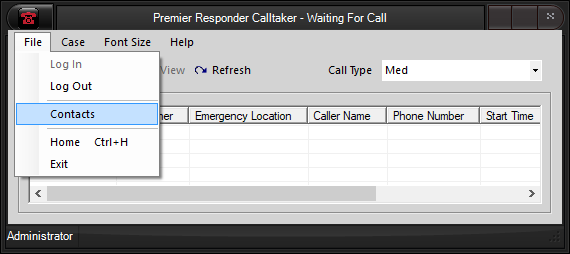
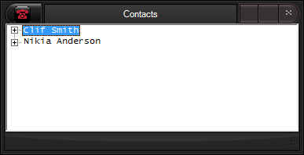
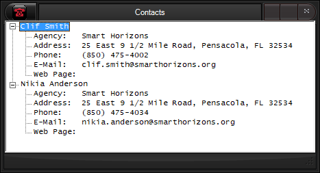

  --------------
  **Contacts**
  --------------

# Contacts Form

The **Contacts** window is used to view the information entered using
the [Contacts Editor](Contacts%20Editor.htm).  Contacts can be viewed
either prior to or after login.  To open the **Contacts** window select
the  **File - Contacts** menu item on the Premier Responder Calltaker
main form.

<figure><figcaption></figcaption></figure>

The **Contacts** window appears with a list of contact names contained
in a tree-view control and the associated contact information initially
hidden.  The form is sizeable and can be adjusted to fit more or less of
the list.  When the text of the list does not fit within the viewable
area of the tree-view control then scrollbars will appear either at the
right and/or bottom of the form.

<figure><figcaption></figcaption></figure>

To display the information for a contact, either resize the form or use
the scrollbars as required to position the contact name within the
viewable area, then select the \"+\" symbol to the left of the name. 
The list item or node containing the contact expands revealing the
associated contact information directly below the name.  To hide the
contact\'s information, select the \"-\" symbol to the left of the
name.  Selecting the control box \"X\" exits the form.

<figure><figcaption></figcaption></figure>
