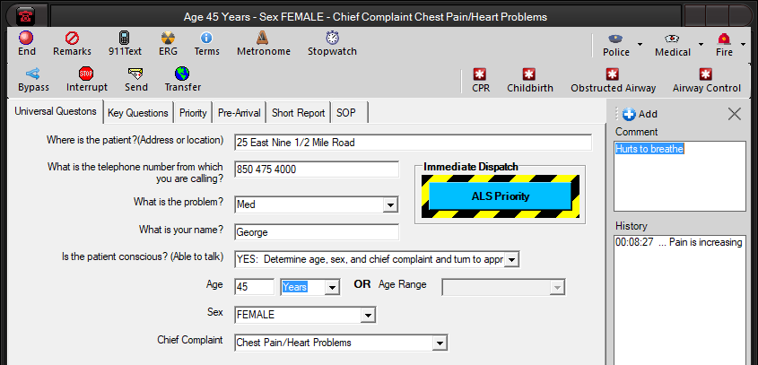

  -------------
  **Remarks**
  -------------

The remarks feature is used to enter call-taker comments.[ 
]{style="mso-spacerun: yes"}These are sent to CAD in the Narrative Text
event and they also appear in the [Case Report](Case%20Reports.htm).  A
preface to the text narrative sent to CAD can be entered into the
**Narrative Preface** setting on the [CAD Interface configuration
screen](Cad%20Interface%20Settings.htm).  The narrative panel appears on
the left side of the active call window.  To close or reopen the remarks
panel:

-   Select the **Remarks** button

-   Select the Alt button to reveal the Hot Keys, then select \"R\"

-   Select the **Ctrl + R** keyboard shortcut.

{border="0" width="845" height="407"}

Call-taker comments are entered in the textbox at the top of the remarks
panel.  The **Narrative Length** setting on the [CAD Interface
configuration screen](Cad%20Interface%20Settings.htm) limits the amount
of text that can be entered.  Select **Add** button or the **Enter** key
to add a comment.  To resize the remarks panel, hover the mouse over the
right border and drag it to the left or right.  Hover the mouse between
the upper and lower text boxes and drag up or down to resize the
**Comment** and **History** fields.  The close (X) toolbar button also
closes the panel. 
