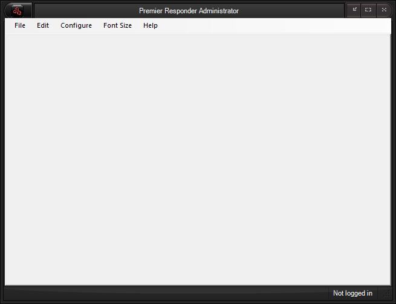

  -------------------------------------
  **Premier Responder Administrator**
  -------------------------------------

[Premier Responder Administrator Window]{.underline}

The Premier Responder Administrator window consists of a menu bar at the
top, a middle utility section, and a status bar at the bottom.  Guide
card  printing is accessible within the **File** menu, content editors
from menu items in the **Edit** menu, and software configuration from
the **Configure** menu.  The print, edit, and configuration screens
appear in the middle utility section, on tab controls.  On the status
bar, the left panel is used to display messages and the right shows the
currently logged in user. 

{border="0" width="655"
height="504"}

[Premier Responder Administrator Functions]{.underline}

The functions that are available from the Premier Responder
Administrator component are found in the following topics:

-   [Logging In](Logging%20In.htm)
-   [Printing](Printing.htm)
-   [Data Management](Data%20Management.htm)
-   [Configuration Settings](Configuration%20Settings.htm)
-   [Call-Archiving](Archiving%20Calls.htm)
-   [Installing Updates](Installing%20Updates.htm)
-   [Logging Out](Logging%20Out.htm)

[Return to Premier Responder Emergency Dispatch
Software](Premier%20Responder.htm)
