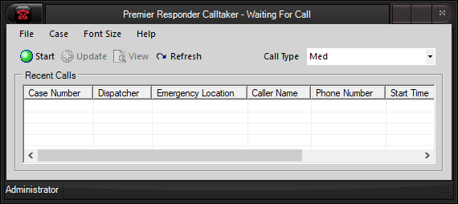

  ----------------------------------
  **Premier Responder Call-taker**
  ----------------------------------

[Premier Responder Call-taker Window]{.underline}

Prior to starting a case, the Premier Responder Calltaker main form
appears as shown below.  It consists of a title bar, menu bar, tool bar,
recent calls table, and a status bar.  The title bar, located at the top
of the form, and the status bar, located at the bottom of the form, both
display information pertaining to the current state and user of the
Premier Responder Calltaker application. Underneath the title bar is the
menu bar.  Logging in and out, contacts, home, and help contents are all
accessed through the menu items on the menu bar.  Below the menu bar is
the tool bar where the controls for those functions, that require quick
access are located. These functions include starting a call, viewing a
case, refreshing the case list, and pre-selecting a call type.

{border="0" width="570" height="254"}

[Premier Responder Call-taker Functions]{.underline}

The functions that are available from the Premier Responder Call-Taker
component are found in the following topics:

-   [Log In](Logging%20In.htm)
-   [Log Out](Logging%20Out.htm)
-   [References](Reference%20Tools.htm)
-   [Entering Calls](Recording%20Calls.htm)

[Return to Premier Responder Emergency Dispatch
Software](Premier%20Responder.htm)
