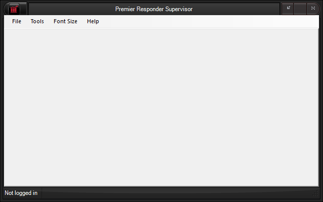

  ----------------------------------
  **Premier Responder Supervisor**
  ----------------------------------

# Premier Responder Supervisor Window

The Premier Responder Supervisor main window consists of a menu bar and
status bar.  From the **Tools** sub menu the [Email
Alerts](Email%20Alert.htm), [Case Review](Case%20Review.htm), [Online
Stations](Online%20Stations.htm) and [Call
Recordings](Call%20Recordings.htm) utilities are accessed.  These open
on tabs within the main window.  The currently logged in user appears on
the left panel of the status bar.

<figure><figcaption></figcaption></figure>

# Premier Responder Supervisor Functions

The tasks/features that are available from the Premier Responder
Supervisor component are as follows:

-   [Logging In](Logging%20In.htm)
-   [Email Alerts](Email%20Alert.htm)
-   [Reviewing Calls](Reviewing%20Calls.htm)
-   [Monitoring Calls](Monitoring%20Calls.htm)
-   [Logging Out](Logging%20Out.htm)

[Return to Premier Responder Emergency Dispatch
Software](Premier%20Responder.htm)
