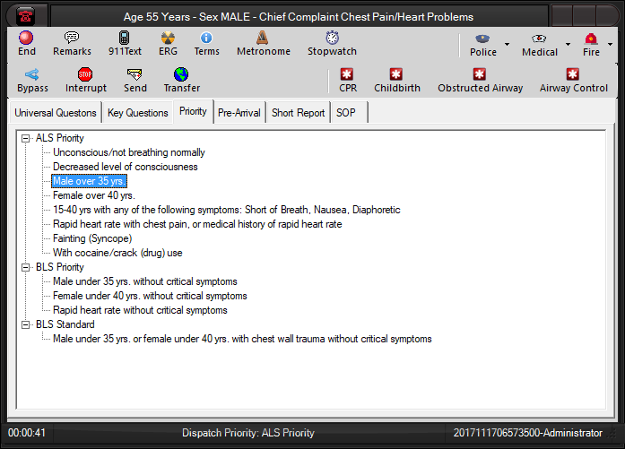

  ----------------
  **Priorities**
  ----------------

The **Priority** tab shows a list of the available response levels with
related symptoms branching out underneath.  Selecting an item in the
list sets the dispatch priority, displaying it on the middle status bar
panel.  The panel can be configured in the [Status Bar Panel
Settings](Status%20Bar%20Panel%20Settings.htm) configuration screen to
display the response level or an assigned code.  CAD is notified with a
Priority Changed event when the dispatch priority is changed.  To change
the tab label or hide the tab, use the settings for Tab #3 on the [Guide
Card Tabs configuration screen](Guide%20Card%20Tabs%20Settings.htm). 
Priority categories are entered in the Priority Categories tab of the
[Call Type Editor](Available%20Call%20Types%20Editor.htm) and symptoms
on the **Priority** sub tab in the [Guide Card
Editor](Guide%20Card%20Editor.htm).

<figure><figcaption></figcaption></figure>
